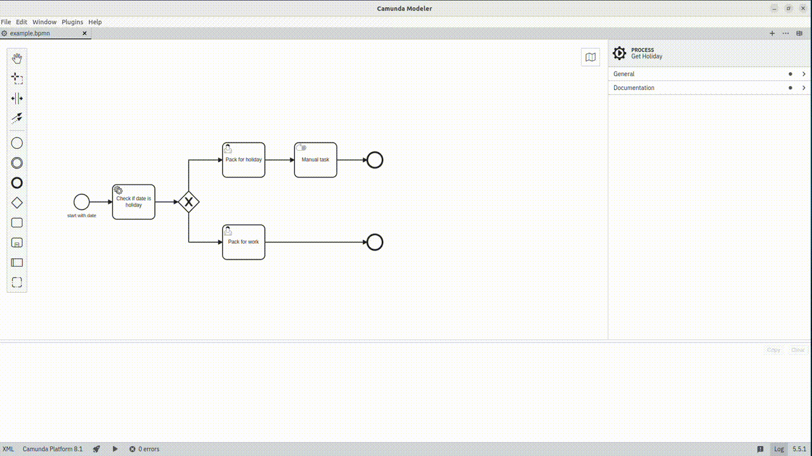

# Camunda Modeler Plugin - Documentation generator

 [](#) [](#)
 [-orange.svg)](#)
 [](#)

This plugin facilitates to generate process diagram documentation for Camunda 8 BPMN diagrams.



## Development Setup

Use [npm](https://www.npmjs.com/), the [Node.js](https://nodejs.org/en/) package manager to download and install required dependencies:

```sh
npm install
```

To make the Camunda Modeler aware of your plugin you must link the plugin to the [Camunda Modeler plugin directory](https://docs.camunda.io/docs/components/modeler/desktop-modeler/plugins/) via a symbolic link.
Available utilities to do that are [`mklink /d`](https://docs.microsoft.com/en-us/windows-server/administration/windows-commands/mklink) on Windows and [`ln -s`](https://linux.die.net/man/1/ln) on MacOS / Linux.

Re-start the app in order to recognize the newly linked plugin.


## Building the Plugin

You may spawn the development setup to watch source files and re-build the client plugin on changes:

```sh
npm run dev
```

Given you've setup and linked your plugin [as explained above](#development-setup), you should be able to reload the modeler to pick up plugin changes. To do so, open the app's built in development toos via `F12`. Then, within the development tools press the reload shortcuts `CTRL + R` or `CMD + R` to reload the app.


To prepare the plugin for release, executing all necessary steps, run:

```sh
npm run all
```

## Additional Resources

* [List of existing plugins](https://github.com/camunda/camunda-modeler-plugins)
* [Plugins documentation](https://docs.camunda.io/docs/components/modeler/desktop-modeler/plugins/)


## Licence

MIT
